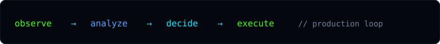

<p align="center">
  
</p>

<p align="center">
  <a href="https://www.danialj.com">
    
  </a>
</p>

<p align="center">
  <a href="https://www.danialj.com"></a>
  <a href="mailto:info@danialj.com"></a>
  <a href="https://www.linkedin.com/in/danial-j-9a9320375"></a>
</p>

<br/>

<p align="center">
  
  &nbsp;
  
</p>

<br/>

<p align="center">
  
</p>

---

### `whoami`

Industrial engineering background. I design and ship **production AI products**, **analytics platforms**, and **automation infrastructure** — systems that keep running after the demo ends.

```bash
$ whoami
danial j · systems builder

$ focus
AI products · BI · automation · data engineering

$ proof
https://www.danialj.com  # live platform = case study
```

---

### `./featured`

| ID | System | Stack |
|----|--------|-------|
| `01` | **[danialj.com](https://www.danialj.com)** — analytics, contact, admin, reports | Next.js · Supabase · Vercel |
| `02` | **[Hooshmand](https://www.danialj.com/#hooshmand)** — culinary AI chatbot (RAG) | Python · Gemini · Groq |
| `03` | Decision intelligence — ERP/CRM/sheets → one layer | ETL · BI · Forecasting |
| `04` | Agent automation — decide → fulfill / hold / escalate | n8n · Agents · CRM/ERP |

---

### `./signal`

<p align="center">
  
  
</p>

<p align="center">
  
</p>

---

### `./stack`

<p align="center">
  
  
  
  
  
  
  
</p>

---

### `./contact`

```diff
+ Hard problems only — production systems, not decks.
! Email    info@danialj.com
! Site     https://www.danialj.com
! LinkedIn Danial j
```

<p align="center">
  <sub><code>neon · graphite · built to last</code></sub>
</p>
